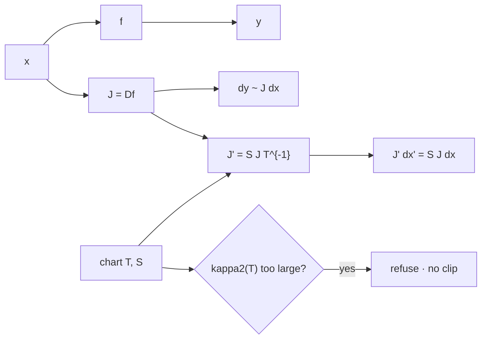

# Jacobian and Sensitivity Propagation Testbed

A computational testbed for propagating local perturbations through
composed scientific models, with derivative verification,
coordinate-consistency tests, and explicit numerical limitations.

Short name **JSPT**. The reusable library import is `sensitivity`.

The project answers more than "what is the Jacobian of this function?"
Its central question is:

> How do changes in inputs and parameters propagate through this
> model—and does that answer remain consistent when we compose or
> re-express the model?

## Map



Caption: raw entries of J are not invariants. Physical pushforward is.
Covariance in a closed chart class only. This repo does not own V, IFC, or proofs.

## What is in the first release

| Responsibility | What the testbed demonstrates |
| --- | --- |
| Derivative checking | Compare a declared Jacobian with central, forward, or complex-step estimates. |
| Composition | Verify that stepwise chain-rule propagation agrees with differentiating the composed map. |
| Coordinate consistency | Transform the model and the perturbation together, then compare physical predictions. |
| Local-validity testing | Measure where `dy ~ J dx` stops describing `f(x+dx)-f(x)`. |
| Correlated uncertainty | Reuse the same Jacobian in `Sigma_y ~ J Sigma_x J^T` and compare with Monte Carlo. |

The coordinate test is the structural distinction. For invertible linear
maps `x' = T x` and `y' = S y`,

```text
J' = S J T^{-1}.
```

We do **not** expect raw Jacobian entries or unscaled singular values to
be invariant under a change of units. We do expect

```text
J' dx' = S (J dx)
```

after the perturbation has been translated. Sensitivity scores that use
matrix norms must declare a scaling.

## Install and run

Python 3.12 or 3.13 and NumPy are required. [uv](https://docs.astral.sh/uv/)
is the supported runner; a plain virtual environment also works.

```bash
git clone https://github.com/giasonpooni/Jacobian-Sensitivity-Propagation-Testbed.git
cd Jacobian-Sensitivity-Propagation-Testbed
uv run --python 3.13 python examples/quickstart.py
uv run --python 3.13 --with pytest pytest -q
```

Without uv:

```bash
python3 -m venv .venv
source .venv/bin/activate
pip install -e . pytest
PYTHONPATH=src python examples/quickstart.py
PYTHONPATH=src pytest -q
```

The quickstart writes `results/quickstart.md`.

## Role next to CSE, RCI, and the torus

This package owns A2–A5 as code. Domain repos wrap types. Consumption is
one way: they may pin a git SHA of *this* repo. This package does not
import GAT, RCI, or `flat_torus`.

The CSE experiment harness binds *record* digests from RCI and the torus.
It does not put `sensitivity` in an SP1 guest. A later integer check of
`P' = T P T^T` on a tiny declared matrix would still be a GAT satellite,
not a rewrite of this kernel.

Experiment here:

```bash
uv run --python 3.13 python examples/quickstart.py
```

Then, in a consumer, wrap `jacobian_at` / `first_order_covariance` /
`push_covariance`. Do not fork those names.

See [docs/KERNEL.md](docs/KERNEL.md).

## Library layout

```text
Reusable sensitivity core
        +
Reference models and derivative checks
        +
Perturbation / covariance experiments
        +
Coordinate-equivalence tests
        +
Reproducible reports
```

```text
from sensitivity import (
    compose,
    jacobian_at,
    jvp,
    check_composition,
    check_coordinate_consistency,
    check_derivative,
    sweep_perturbation_scale,
)
```

Existing fluid, construction, and observer projects can consume
`sensitivity` where that removes duplication. They do not need the
experiment suite.

## Scope and limits

First-order, local, explicit compositions only. Global sensitivity,
discontinuous mode changes, trajectory sensitivities, and a separately
named Sensitivity Propagation Runtime are compatible extensions—not
implied capabilities.

First-order covariance is exact for affine maps. For nonlinear maps the
testbed reports the Monte Carlo gap instead of treating the formula as
unconditionally adequate.

See [docs/SCOPE.md](docs/SCOPE.md) and [docs/METHODS.md](docs/METHODS.md).

## License

MIT. See [LICENSE](LICENSE).
